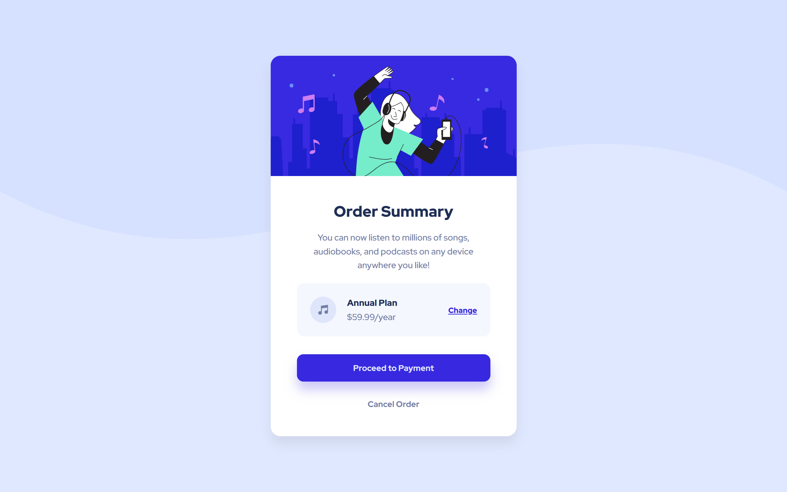
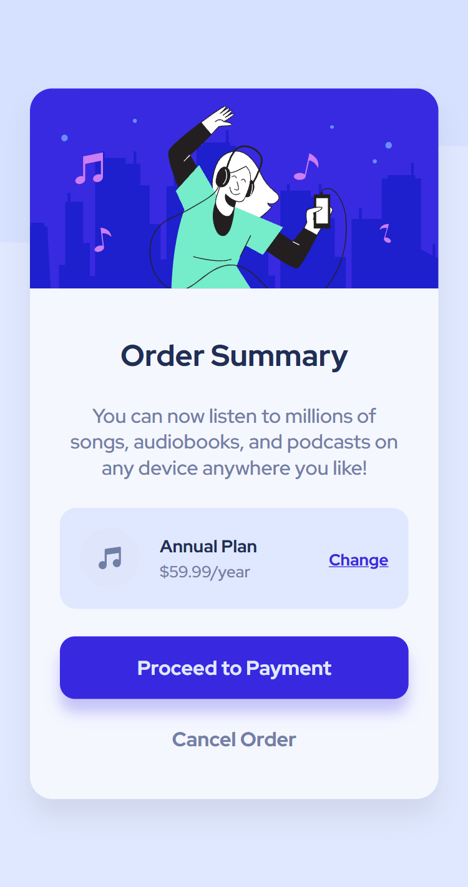
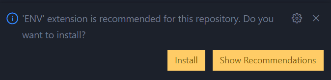
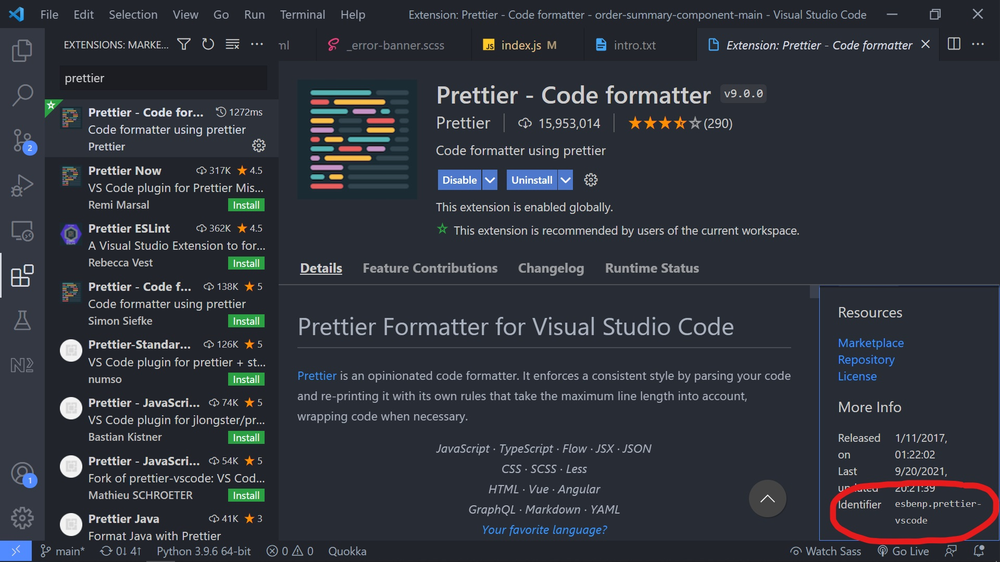

[](https://app.netlify.com/sites/order-summary-page-farisp/deploys)

# Frontend Mentor - Order summary card solution

This is a solution to the [Order summary card challenge on Frontend Mentor](https://www.frontendmentor.io/challenges/order-summary-component-QlPmajDUj). Frontend Mentor challenges help you improve your coding skills by building realistic projects.

## Table of contents

- [Frontend Mentor - Order summary card solution](#frontend-mentor---order-summary-card-solution)
  - [Table of contents](#table-of-contents)
  - [Overview](#overview)
    - [The challenge 🎯](#the-challenge-)
    - [Screenshot 📸](#screenshot-)
    - [Features ✨](#features-)
    - [Supported Browsers 🌐](#supported-browsers-)
    - [Project File Structure 🏗](#project-file-structure-)
    - [Links 🔗](#links-)
  - [My process](#my-process)
    - [Built with 🛠](#built-with-)
      - [Deployed on:](#deployed-on)
    - [Site Architecture](#site-architecture)
    - [What I learned](#what-i-learned)
    - [How it's done](#how-its-done)
      - [Blur-up image loading](#blur-up-image-loading)
    - [Continued development](#continued-development)
    - [Useful resources](#useful-resources)
  - [Author](#author)

## Overview

### The challenge 🎯

- Users should be able to see hover states for interactive elements
- Make the site compatible with IE10 and IE11.
- Do not use any pollyfills or tools like typescript or babel to achieve that.

### Screenshot 📸

- On 1440px width 900px height (desktop)



- On 375px width 709px height (mobile)



### Features ✨

- Stripe payment
- Blur-up image loading
- Button ripple effect
- IE10, IE11 compatible
- Fluidly responsive
- Conventional loading spinner on button
- Error snackbar on request failure

### Supported Browsers 🌐

- Chrome
- Firefox
- Edge
- Brave
- Opera
- IE11
- IE10

**If you are a mac user**, I'd appreciate it if you check it on safari and let me know if it works on it or not.
feel free to make a pull request or issue.

### Project File Structure 🏗

```
.
├── .vscode/
│   ├── extensions.json
├── frontend/
│   ├── design/
│   └── images/
│   └── sass/
│   └── scripts/
│   └── index.html
│   └── .gitignore
│   └── package.json
│   └── snowpack.config.js
├── server/
│   ├── server.ts
│   └── .env
│   └── Procfile
│   └── .gitignore
│   └── package.json
│   └── tsconfig.json
├── .prettierrc.json
└── README.md
```

### Links 🔗

- Solution URL: [Add solution URL here](https://your-solution-url.com)
- Live Site URL: [Add live site URL here](https://your-live-site-url.com)

## My process

### Built with 🛠

- Semantic HTML5 markup
- CSS custom properties
- Flexbox
- Mobile-first workflow
- Sass
- Snowpack
- ExpressJs
- Typescript
- Ts-node
- Stripe

#### Deployed on:

- Netlify
- Heroku

### Site Architecture

- I split my files into two folders, frontend and backend. Mainly because I wanted to deploy the frontend on Netlify and backend on Heroku.
- I used a simple format/method when writing commit messages. By adding certain keywords like **chore**, **build**, and **feat**, I made sure the commit messages are more organized and readable. (I got this method from the VueJs github repository.)

  - chore: if it is a small/mundane task
  - feat: when added new feature
  - build: build, deployment related changes
  - refactor: when rewriting or making changes to existing code(refactoring)

### What I learned

I learned **_a lot of stuff_** while doing this project.

- Firstly, I **learned how to use Stripe to make basic payments**. Although, I have a long way to go before I understand all its APIs and how it actually works.
- Since I wrote javascript code that needed to be compatible with IE, I got an overview of which js features works with IE and which does not. **Some things that IE does not support:**

  - In CSS

    - CSS Custom Properties (CSS Variables)
    - Full support of Flexbox
    - Full support of CSS Grid
    - `min()`, `max()` and `clamp()`
    - CSS logical properties. Eg: `inset`
    - `fit-content`, `min-content`, `max-content`

  - In Javascript

    - Arrow functions
    - Promises
    - JS Modules
    - Fetch API (since it's a promise)
    - Async await
    - Destructuring
    - Spread, rest syntax
    - Template literals
    - `let` and `const` (IE10 and below)
    - `addEventListener()` (IE8 and below)
    - Array methods like `forEach()`, `reduce()`, `map()` (IE8 and below)
    - event.key (use event.keyCode instead)

- Got to know a **built-in Sass function `math.is-unitless()`**. Which checks if the passed argument has a unit or not, and returns a boolean based on that. I used it in the `toRem()` function to avoid accidentally passing values that has units.
- Learned how to use a base64 encoded image in an SVG.
- I didn't really know that there was a difference between `.addEventListener()` and `.onclick`, which is being that, while **`.addEventListener()` can be used as many s as we want, the `.onclick` can be used only once.** Which makes sense when thinking about it, because when using `.onclick`, we are just directly changing a method. So what that means that:

```js
// while here the func and func2 is called
btn.addEventListener("click", func);
btn.addEventListener("click", func2);

// here, only the func2 is called
btn.onclick = func;
btn.onclick = func2;
```

<!-- prettier-ignore -->
```html
<!-- unrelated attributes and stuff are omitted for brevity -->
<svg>
  <image xlink:href="data:image/png;base64,iVBORw0KG..." /> <!-- 👈 base64 image goes here -->
</svg>
```

- Also, learned how to make an XMLHttpRequest(xhr). This was what used to make requests before the Fetch API.
- I mostly wrote my `font-size` values in `px` unit on the root and in `rem` everywhere else. Because, that way I can change font sizes relatively throughout the site pretty easily by only changing the root font-size. But, turned out, It will affect accessibility badly. Because, when a user sets a larger/smaller font on their browser, it won't take effect since the font size is set using `px` on the root. So, I used `rem` unit on the root instead. So that it will be relative to the user's preferred font size. Big thanks _ and _ for helping me out on it.
- Learned how to get a recommended vscode extension notification using the .vscode/extensions.json file.
  By adding an extension's identifier as the value of `recommendations` in the extensions.json file in the .vscode directory. For example: vscode .env syntax highlighter extension's identifier is "irongeek.vscode-env". To show that as a recommended extension, add

  ```json
  // .vscode/extensions.json
  {
    "recommendations": ["irongeek.vscode-env"]
  }
  ```

  

  <details>
    Identifier can be found in the extension's page.

  
    <summary>Get the identifier of a vscode extension</summary>
  </details>

- I learned some new git commands as well:
  - `git add -p` : It can be used to stage only the desired changes to git. i.e. it'll make it possible to stage/add chunks/hunks of changes rather than all the changes.
  - `git reflog` - Kinda like `git log`, but gives more info. It can be used to undo even a hard reset.
  - `git merge --abort` - To abort a merge and go back. Useful when there are a lot of merge conflicts and you simply wanna go back to the previous state.
  - `git reset --merge` - to reset a merge. Like resetting(going back to) a commit, but for merges.
- Furthermore, I implemented a bunch of best practices that I've heard before like,
  - Don't show a user a button that does not work (UX) <!--! add more if there's any -->
  - Don't use CSS style related classes to get an element in javascript or in testing. Use a prefixed class or other attributes, for eg: `data` attributes. (I used a `js-` prefix in this project)

### How it's done

High level overview of how some features are implemented.

#### Blur-up image loading

<details>
Popular apps like whatsapp, facebook, and sites like medium uses the blur-up technique to load images on their site/app. Where, a blurred version of the image is shown until the image has loaded.

<br />
<br />

I followed this [article]() from CSS-Tricks to create the effect. Though, I have done a few things slightly differently.

steps:

1. Take the image and create a smaller version of that. It should be around 40 pixels height and width (but keep the aspect-ratio).
2. Convert it to base64.
3. Put that into a Gausean Blur applied svg's image tag.

```html
<svg
  xmlns="http://www.w3.org/2000/svg"
  xmlns:xlink="http://www.w3.org/1999/xlink"
  width="1500"
  height="823"
  viewBox="0 0 1500 823"
>
  <filter
    id="blur"
    filterUnits="userSpaceOnUse"
    color-interpolation-filters="sRGB"
  >
    <feGaussianBlur stdDeviation="20 20" edgeMode="duplicate" />
    <feComponentTransfer>
      <feFuncA type="discrete" tableValues="1 1" />
    </feComponentTransfer>
  </filter>
  <image
    filter="url(#blur)"
    xlink:href="data:image/png;base64,iVBORw0KG..." <!-- add the base64 image here -->
    x="0"
    y="0"
    height="100%"
    width="100%"
  />
</svg>
```

1. Now, convert that svg to base64
2. show that as the image until the actual image is loaded.
3. Show the actual image when it's loaded using javascript
  <summary>Blur up loading</summary>
</details>

### Continued development

This project will be my last project where I focus on making the site cross-compatible with Internet Explorer Browser. Coding for IE is a nightmare and fortunately (and finally), Microsoft has officially declared its retirement. IE is no longer available in the newest Windows 11 as well.

### Useful resources

- [Example resource 1](https://www.example.com) - This helped me for XYZ reason. I really liked this pattern and will use it going forward.
- [Example resource 2](https://www.example.com) - This is an amazing article which helped me finally understand XYZ. I'd recommend it to anyone still learning this concept.

**Note: Delete this note and replace the list above with resources that helped you during the challenge. These could come in handy for anyone viewing your solution or for yourself when you look back on this project in the future.**

## Author

- Frontend Mentor - [@farispalayi](https://www.frontendmentor.io/profile/farispalayi)
- Twitter - [@farispalayi](https://www.twitter.com/farispalayi)
- LinkedIn - [@farispalayi](https://www.linkedin.com/in/farispalayi)
